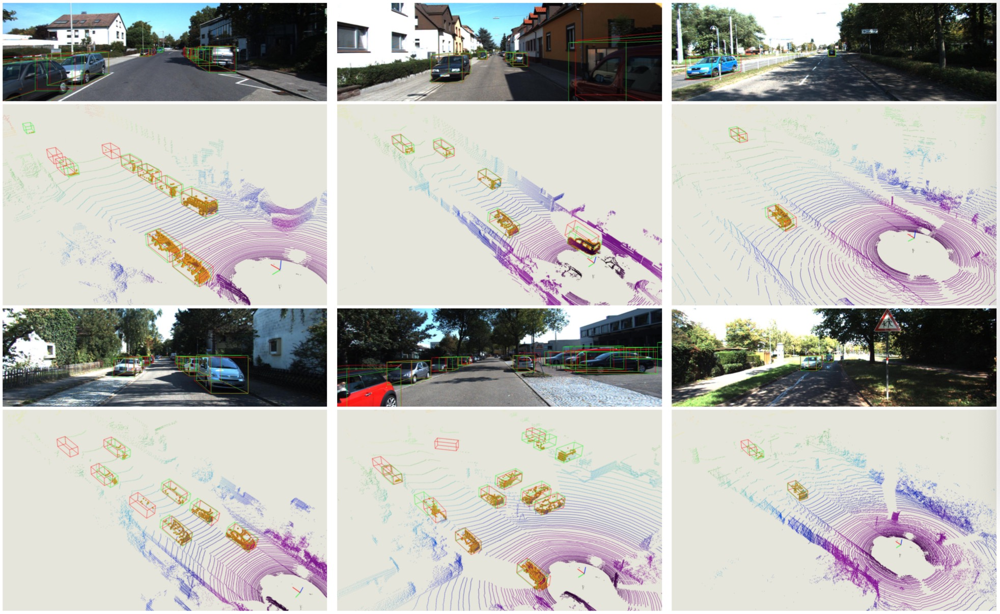

## Rethinking Pseudo-LiDAR Representation

### Introduction

This project is based on our ECCV 2020 paper. In this work, we perform an in-depth investigation and observe that the efficacy of pseudo-LiDAR representation comes from the coordinate transformation, instead of data representation itself. Based on this observation, we design an image based CNN detector named PatchNet, which is more generalized and can be instantiated as pseudo-LiDAR based 3D detectors. Moreover, the pseudo-LiDAR data in our PatchNet is organized as the image representation, which means existing 2D CNN designs can be easily utilized for extracting deep features from input data and boosting 3D detection performance.





Besides, this project also provides the pytorch implenmentation of FPointNet and pseudo-LiDAR with competitive accuracies. 

### Citation

If you find our work useful in your research, please consider citing:

```latex
@InProceedings{Ma_2020_ECCV,
author = {Ma, Xinzhu and Liu, Shinan and Xia, Zhiyi and Zhang, Hongwen and Zeng, Xingyu and Ouyang, Wanli},
title = {Rethinking Pseudo-LiDAR Representation},
booktitle = {Proceedings of the European Conference on Computer Vision (ECCV)},
year = {2020}}
```


### Usage

#### Installation

Download this repository (tested under python3.6, pytorch1.1 and ubuntu 14.04).  There are also some dependencies like `cv2, yaml, tqdm, etc.`, and please install them accordingly:
```sh
cd #root
pip install -r requirements
```


 Then, you need to compile the evaluation script:

```sh
cd root/tools/kitti_eval
sh compile.sh
```


#### Prepare your data

First, you should download the [KITTI dataset](http://www.cvlibs.net/datasets/kitti/eval_object.php?obj_benchmark=3d), and organize the data as follows  (*: this is an empty directory to store the data generated in subsequent steps):

```
#ROOT
  |data
    |KITTI
      |2d_detections
      |ImageSets
      |pickle_files *
      |object			
        |training
          |calib
          |image_2
          |label
          |depth *
          |pseudo_lidar (optional for Pseudo-LiDAR)*
          |velodyne (optional for FPointNet)
        |testing
          |calib
          |image_2
          |depth *
          |pseudo_lidar (optional for Pseudo-LiDAR)*
          |velodyne (optional for FPointNet)
```

Then you need to prepare your depth maps and put them to `data/KITTI/object/training/depth`. To provide ease of use, we also provide the estimated depth maps (these data generated from the pretrained models provided by [DORN](https://github.com/hufu6371/DORN) and [Pseudo-LiDAR](https://github.com/mileyan/pseudo_lidar)).

| Monocular (DORN)  | Stereo (PSMNet) |
| ---------------- | ------- |
| [trainval(~1.6G)](https://drive.google.com/file/d/1VLG8DbjBnyLjo2OHmrb3-usiBLDcH7JF/view?usp=sharing), [test(~1.6G)](https://drive.google.com/file/d/1dL0vE-2ur031tJ01KYp4qtifxYWcQSN5/view?usp=sharing) | [trainval(~2.5G)](https://drive.google.com/file/d/1CIHsBwBTtAZxKlGJ5jS41OXySNXiqBIF/view?usp=sharing) |

Finally, generate the training data using provided scripts :

```sh
cd #root/tools/data_prepare
python patch_data_prepare.py --gen_train --gen_val --gen_val_rgb_detection --car_only
mv *.pickle ../../data/KITTI/pickle_files
```

You can also generate the data for pseudo-LiDAR or FPointNet models using `frustum_data_prepare.py`. Note you need to run `depth2pseudolidar.py` before generating the data for pseudo-LiDAR based models.


#### Training

Move to the patchnet workplace (we also provide the codes of FPointNet and pseudo-LiDAR, and welcome to try them) and train the mode (also need to **modify the path of pickle files in config file**):

```sh 
 cd #root
 cd experiments/patchnet
 python ../../tools/train_val.py --config config_patchnet.yaml
```


For ease of use, we also provide the pretrained models, and the performances (AP3D@11 for the pretained models / original paper) are shown as follows: 

| Models | AP3D11@easy | AP3D11@mod.| AP3D11@hard|
| -------- | ------- | -------- | ------- |
| [PatchNet@monocular](https://drive.google.com/file/d/14mSm-D1v9i2ICmGc_Nbt_tGg3FxmWj6W/view?usp=sharing) | 34.8 / 35.1 |22.0 / 22.0  |19.5 / 19.6  |
| [PatchNet@stereo](https://drive.google.com/file/d/1fyCqo9i_Pekmh-EonYvDvN-1AxPGvr2n/view?usp=sharing) | 67.4 / 65.9 |42.3 / 42.5  |38.4 / 38.5  |

Note that the pre-trained models are trained in a shorter training schedule (100 epoches).


#### Evaluation

Generate the results using the trained model:

```sh
 python ../../tools/train_val.py --config config_patchnet.yaml --e
```

and evalute the generated results using:

```sh
../../tools/kitti_eval/evaluate_object_3d_offline_ap11 ../../data/KITTI/object/training/label_2 ./output
```
or 
```sh
../../tools/kitti_eval/evaluate_object_3d_offline_ap40 ../../data/KITTI/object/training/label_2 ./output
```

Note: all the above commands are packed in the run.sh, and you can use following command for both training and testing:
```sh
sh run.sh
```


### Change Logs

- 08/17/2020: add a script for visualization


### Acknowlegment

This code benefits from the excellent work [FPointNet](https://github.com/charlesq34/frustum-pointnets) and use the pre-trained models provided by [DORN](https://github.com/hufu6371/DORN) and [pseudo-LIDAR](https://github.com/mileyan/pseudo_lidar). Please also consider citing these works.


### Contact

If you have any question about this project, please feel free to contact xinzhu.ma@sydney.edu.au.
